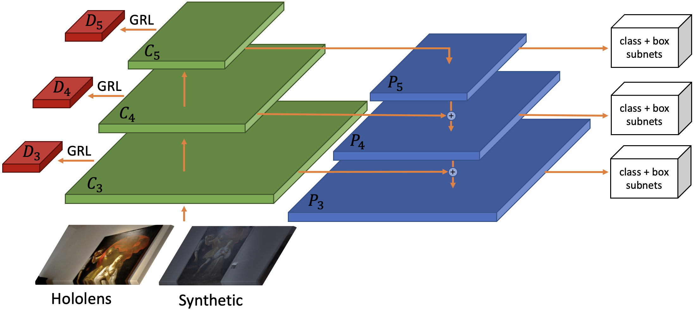
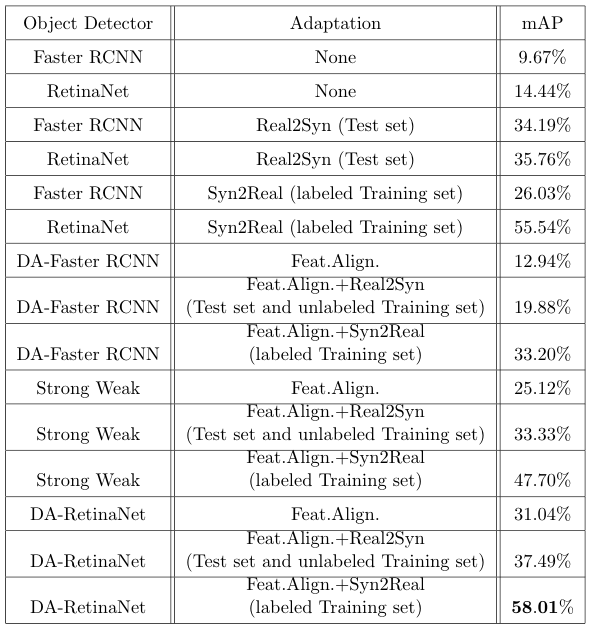

# Detectron2 implementation of DA-RetinaNet [An Unsupervised Domain Adaptation Scheme for Single-Stage Artwork Recognition in Cultural Sites](https://arxiv.org/abs/2008.01882v3) (Image and Vision Computing)


## Introduction
Follow the official guide to install [Detectron2 0.2.1](https://github.com/facebookresearch/detectron2/blob/master/INSTALL.md) on your pc.

### Data Preparation
If you want to use this code with your dataset arrange the dataset in the format of COCO. Inside the script uda_train.py register your dataset using <br> ```register_coco_instances("dataset_name_soruce_training",{},"path_annotations","path_images")```<br>
```register_coco_instances("dataset_name_target_training",{},"path_annotations","path_images")```<br>
```register_coco_instances("dataset_name_target_test",{},"path_annotations","path_images")```<br>

### Training
Replace at the following path ```detectron2/modeling/meta_arch/``` the retinanet.py script with our retinanet.py. Do the same for the fpn.py file at the path ```detectron2/modeling/backbone/```<br>
Run the script uda_train.py <br>
Trained model is available at this links: <br>
[DA-RetinaNet](https://iplab.dmi.unict.it/EGO-CH-OBJ-UDA/DA-RetinaNet.pth) <br>

### Testing
If you want to test the model load the new weights, set to 0 the number of iterations and run the uda_train.py

### Results
<p>

</p>

|                 |                image-to-Image translation   |
| --------------- |:------------:| ----------------------------:|
| Object Detector |     None     |       Synthetic to Real      |
| DA-Faster RCNN  |    12.94%    |             33.20%           |
| Strong Weak     |    25.12%    |             47.70%           |
| DA-RetinaNet    |    31.04%    |             58.01%           |

## Citation
Please cite the following [paper](https://arxiv.org/abs/2008.01882) if you use this repository for your project.
```
@article{pasqualino2021synthetic,
  url = { https://iplab.dmi.unict.it/EGO-CH-OBJ-UDA/ },
  pdf = { https://arxiv.org/pdf/2008.01882v2.pdf },
  journal = {  Image and Vision Computing  },
  year = { 2021 },
  author = { Giovanni Pasqualino and Antonino Furnari and Giovanni Signorello and Giovanni Maria Farinella },
  title = { An Unsupervised Domain Adaptation Scheme for Single-Stage Artwork Recognition in Cultural Sites },
}
```
## Other Works
[MDA-RetinaNet](https://github.com/fpv-iplab/MDA-RetinaNet)
