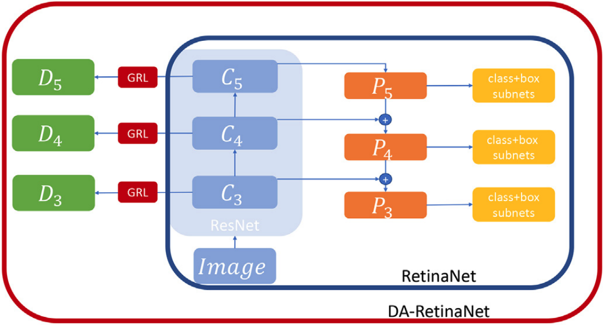

# Detectron2 implementation of DA-RetinaNet
<center></center>
This is the implementation of our Image and Vision Computing 2021 work 'An unsupervised domain adaptation scheme for single-stage artwork recognition in cultural sites'. The aim is to reduce the gap between source and target distribution improving the object detector performance on the target domain, in the screnario where training and test data are drawn from different distributions. The original paper can be found (here)[https://www.sciencedirect.com/science/article/pii/S0262885621000032?dgcid=rss_sd_all]

## Installation
You can use this repo following one of these three methods:

### Detectron 2 on your PC
Follow the official guide to install [Detectron2 0.2.1](https://github.com/facebookresearch/detectron2/blob/master/INSTALL.md)

### Detectron2 via Dockerfile
Follow these instructions:
```
cd docker/
# Build 
docker build -t detectron2:v0 .

# Launch
docker run --gpus all -it --shm-size=8gb -v /home/yourpath/:/home/yourpath --name=name_container detectron2:v0
```
If you exit from the container you can restart it using:
```
docker start name_container
docker exec -it name_container /bin/bash
```

### Google Colab
Load and run the ```DA-RetinaNet.ipynb``` on Google Colab following the instructions inside the notebook.

### Dataset
Dataset is available [here](https://iplab.dmi.unict.it/EGO-CH-OBJ-UDA/EGO-CH-OBJ-UDA.zip)

### Data Preparation
If you want to use this code with your dataset arrange the dataset in the format of COCO or PASCAL VOC. <br>
For COCO annotations, inside the script ```uda_train.py``` register your dataset using: <br>

```register_coco_instances("dataset_name_soruce_training",{},"path_annotations","path_images")```<br>
```register_coco_instances("dataset_name_target_training",{},"path_annotations","path_images")```<br>
```register_coco_instances("dataset_name_target_test",{},"path_annotations","path_images")```<br>

For PASCAL VOC annotations, inside the ```cityscape_train.py``` register your dataset using: <br>

```register_pascal_voc("city_trainS", "cityscape/VOC2007/", "train_s", 2007, ['car','person','rider','truck','bus','train','motorcycle','bicycle'])```<br>
```register_pascal_voc("city_trainT", "cityscape/VOC2007/", "train_t", 2007, ['car','person','rider','truck','bus','train','motorcycle','bicycle'])```<br>
```register_pascal_voc("city_testT", "cityscape/VOC2007/", "test_t", 2007, ['car','person','rider','truck','bus','train','motorcycle','bicycle'])```<br>

You need to replace the parameters inside the ```register_pascal_voc()``` function according to your dataset name and classes. <br>

### Training
Replace at the following path ```detectron2/modeling/meta_arch/``` the ```retinanet.py``` script with our ```retinanet.py```. <br>
Do the same for the ```fpn.py``` file at the path ```detectron2/modeling/backbone/```<br>

Run the script ```uda_train.py``` for COCO annotations or ```cityscape_train.py``` for PASCAL VOC annotations. <br>

Trained models on the proposed dataset are available at these links: <br>
[DA-RetinaNet](https://iplab.dmi.unict.it/EGO-CH-OBJ-UDA/DA-RetinaNet.pth) <br>
[DA-RetinaNet-CycleGAN](https://iplab.dmi.unict.it/EGO-CH-OBJ-UDA/DA-RetinaNet-CycleGAN.pth) <br>

### Testing
If you want to test the model load the new weights, set to 0 the number of iterations and rerun the same script used for the training.

### Results on the proposed dataset Synthetic -> Real
<p>
  Results of DA-Faster RCNN, Strong-Weak and the proposed DA-RetinaNet combined with image-to-image translation approach.
</p>

<table style="width:100%">
  <tr>
    <th></th>
    <th colspan="2">image to image translation (CycleGAN)</th>
  </tr>
  <tr>
    <td>Object Detector</td>
    <td>None</td>
    <td>Synthetic to Real</td>
  </tr>
   <tr>
    <td><a href="https://openaccess.thecvf.com/content_cvpr_2018/papers/Chen_Domain_Adaptive_Faster_CVPR_2018_paper.pdf">DA-Faster RCNN</a></td>
    <td>12.94%</td>
    <td>33.20%</td>
  </tr>
   <tr>
    <td><a href= "https://openaccess.thecvf.com/content_CVPR_2019/papers/Saito_Strong-Weak_Distribution_Alignment_for_Adaptive_Object_Detection_CVPR_2019_paper.pdf"> StrongWeak</a></td>
    <td>25.12%</td>
    <td>47.70%</td>
  </tr>
  <tr>
    <td>DA-RetinaNet</td>
    <td>31.04%</td>
    <td>58.01%</td>
  </tr>
</table>

### Results on Cityscapes -> Foggy Cityscapes
<p>
Results adaptation between Cityscapes and Foggy Cityscapes dataset. The performance scores of the methods marked with the “*” symbol are reported from the authors of their respective papers.
</p>

<table style="width:100%">
  <tr>
    <th>Model</th>
    <th>mAP</th>
  </tr>
  <tr>
    <td><a href="https://openaccess.thecvf.com/content_cvpr_2018/papers/Chen_Domain_Adaptive_Faster_CVPR_2018_paper.pdf">Faster RCNN*</a></td>
    <td>20.30%</td>
  </tr>
  <tr>
    <td><a href="https://openaccess.thecvf.com/content_cvpr_2018/papers/Chen_Domain_Adaptive_Faster_CVPR_2018_paper.pdf">DA-Faster RCNN*</a></td>
    <td>27.60%</td>
  </tr>
  <tr>
    <td><a href= "https://openaccess.thecvf.com/content_CVPR_2019/papers/Saito_Strong-Weak_Distribution_Alignment_for_Adaptive_Object_Detection_CVPR_2019_paper.pdf"> StrongWeak*</a></td>
    <td>34.30%</td>
  </tr>
  <tr>
    <td><a href="https://openaccess.thecvf.com/content_CVPR_2019/papers/Kim_Diversify_and_Match_A_Domain_Adaptive_Representation_Learning_Paradigm_for_CVPR_2019_paper.pdf">Diversify and Match*</td>
    <td>34.60%</td>
  </tr>
  <tr>
    <td>RetinaNet</td>
    <td>40.25%</td>
  </tr>
  <tr>
    <td>DA-RetinaNet</td>
    <td>44.87%</td>
  </tr>
  <tr>
    <td>RetinaNet (Oracle)</td>
    <td>53.46%</td>
  </tr>
</table>

## Citation
Please cite the following [paper](http://www.sciencedirect.com/science/article/pii/S0262885621000032) and leave a star ⭐ if you use this repository for your project.
```
@article{PASQUALINO2021104098,
    title = "An unsupervised domain adaptation scheme for single-stage artwork recognition in cultural sites",
    journal = "Image and Vision Computing",
    pages = "104098",
    year = "2021",
    issn = "0262-8856",
    doi = "https://doi.org/10.1016/j.imavis.2021.104098",
    author = "Giovanni Pasqualino and Antonino Furnari and Giovanni Signorello and Giovanni Maria Farinella",
}
```
## Other Works
[MDA-RetinaNet](https://github.com/fpv-iplab/MDA-RetinaNet)
